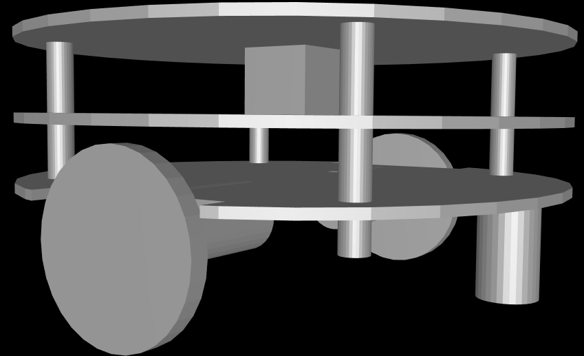
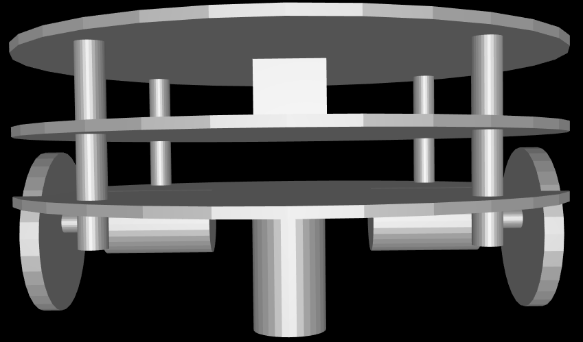

# FirstRobotBlender
Simple example of robot design using Blender

This a simple example from a book and modified by me in order to understand how Blender works for robot design and how CAD file are exported.

STL file is available.

